# LEARN TAROT

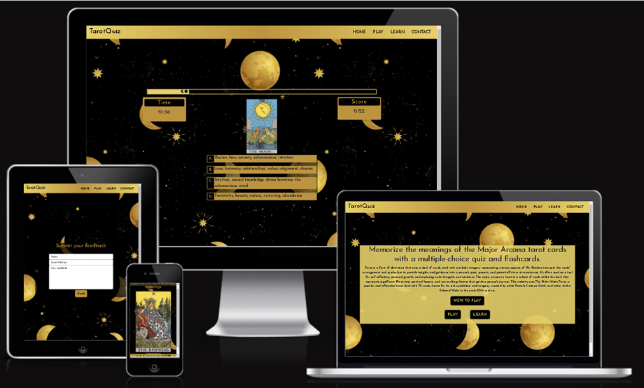

(Developer: Martyna Nowak)

[Live Webpage](https://mmnowak.github.io/tarot-quiz/index.html)

## Table of Contents

1. [Project Goals](#project-goals)
    1. [Overview](#overview)
    2. [Goals](#goals)
2. [User Experience](#user-experience)
    1. [Target Audience](#target-audience)
    1. [User Requirements and Expectations](#user-requirements-and-expectations)
    2. [User Stories](#user-stories)
3. [Design](#design)
    1. [Colour scheme](#colour-scheme)
    2. [Typography](#typography)
    3. [Imagery](#imagery)
    4. [Wireframes](#wireframes)
4. [Features](#features)
5. [Technologies Used](#technologies-used)
    1. [Languages](#languages)
    2. [Frameworks and Tools](#frameworks-and-tools)
6. [Testing and bugs](#testing-and-bugs)
7. [Credits](#credits)
    1. [Media](#media)
    2. [Code used](#code-used)
    3. [Content](#content)
8. [Deployment](#deployment)
10. [Acknowledgements](#acknowledgements)

## User Experience

### Target Audience

* People interested in learning more about Tarot;
* Tarot begginers and intermediate users;
* People interested in spirituality and psychology;
* Visual learners;

### User Requirements and Expectations

* Links and buttons that work as expected.
* A simple and intuitive navigation system.
* Interactive feedback and notifications.
* Information presented in clear and concise manner.
* Visually appealing design.
* Easy way to submit questions and feedback.
* Accessibility.

### User Stories

#### First Time visitor
1.	As a first-time user, I want to know the purpose of the site immediately,
2.	As a first-time user, I want to easily find out how to play the game,
3.	As a first-time user, I want to know how far along I am in the quiz game,
4.	As a first-time user, I want to know whether the answer I selected was right or wrong,
5.	As a first-time user, I want to know my final score,
6.	As a first-time user, I want to receive feedback about my performance,
7.	As a first-time user, I want to find out how to use the flashcards page.

#### Returning visitor
1.	As a returning user, I want the feedback at the end of the game to reflect my performance,
2.	As a returning user, I want to be able to contact the page owners with any feedback I might have,
3.	As a returning user, I want to find out the full meaning of each card,
4.	As a returning user, I want to be able to navigate the website easily.

## Design

### Colour scheme

The colours were taken from the background image using a colour picker tool.

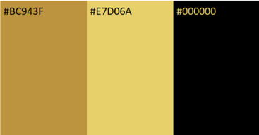

WebAIM Contrast Checker was used to ensure the site is accessible. Both [#BC943F](https://webaim.org/resources/contrastchecker/?fcolor=BC943F&bcolor=000000) and [#E7D06A](https://webaim.org/resources/contrastchecker/?fcolor=E7D06A&bcolor=000000) have passed the test. 

### Typography

[Josefin Sans](https://fonts.google.com/specimen/Josefin+Sans)

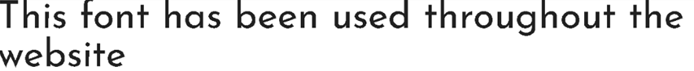

### Imagery

### Wireframes

Index Page

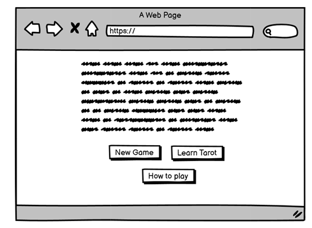

Game Page

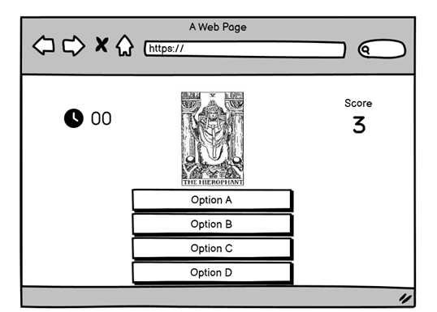

Learn Tarot Page

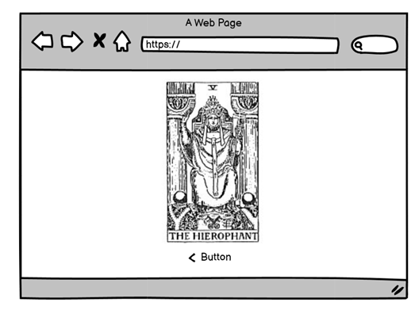

## Features

### All Pages

#### Navigation Bar

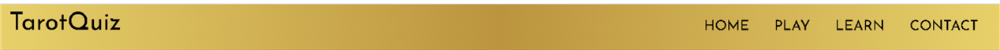

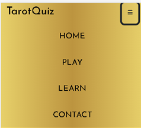

#### Footer

#### Favicon

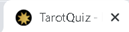

### Index Page

#### Index Text

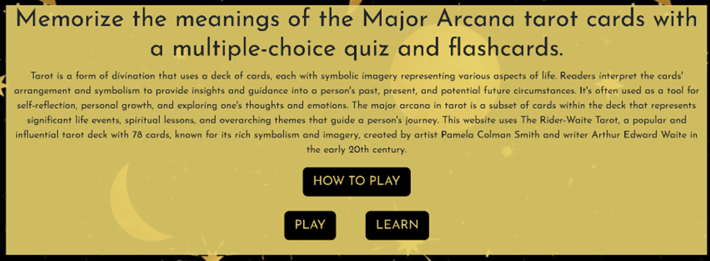

#### Buttons

#### How to play Button

#### How to play Modal

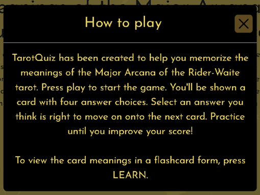

### Quiz Page

#### Progress Bar

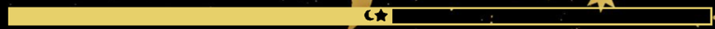

#### Timer

#### Score

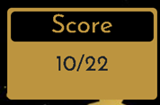

#### Game

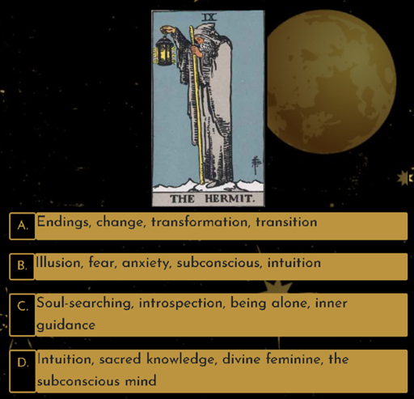

##### Correct Choice

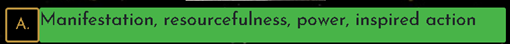

##### Incorrect Choice

#### End Message

### Learn Page

#### Flashcards

#### Full Meaning Button and Modal

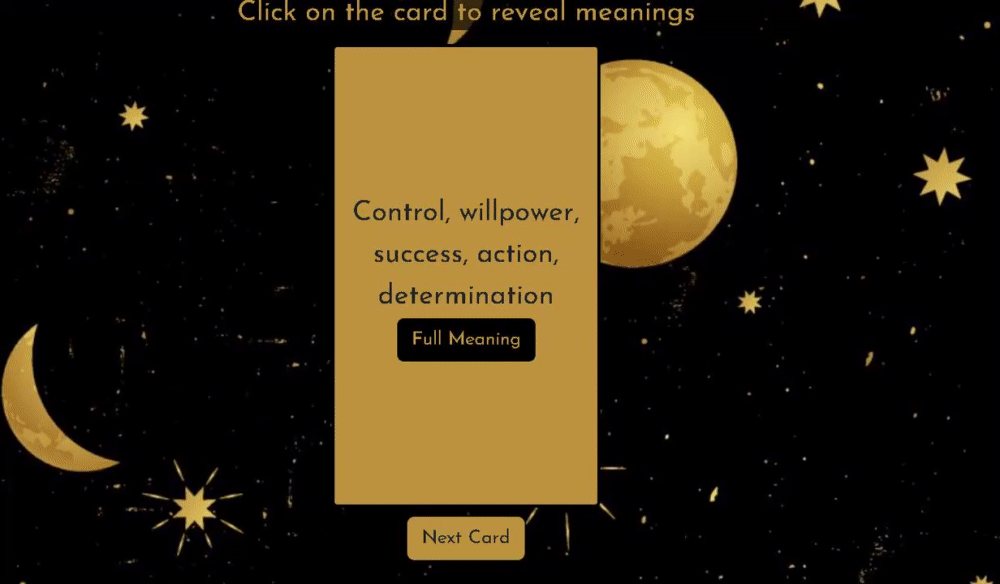

#### Next Card Button

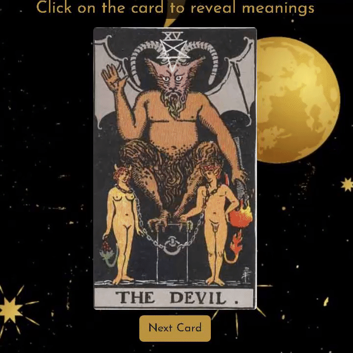

### Contact Page

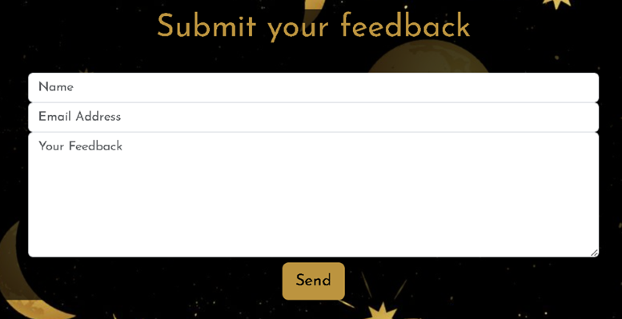

### 404 Page

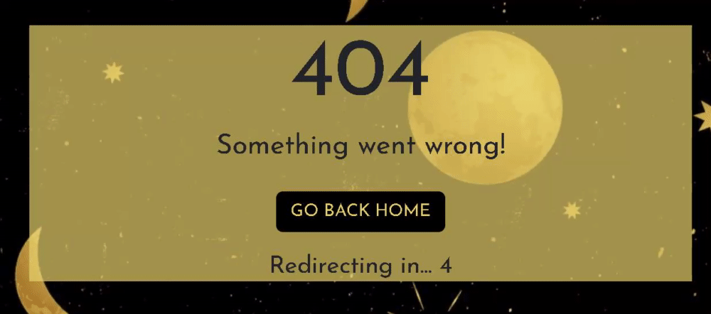

### Accessibility

I took the following steps to ensure the website is accessible:

* Used aria-labels for icons to to enable screen readers to understand them.
* Used aria-current to indicate the current page for screen readers.
* Provided all card images with alternative description.
* Used a sans serif font to ensure the website is dyslexia-friendly.

## Technologies Used

### Languages

* [HTML](https://en.wikipedia.org/wiki/HTML)
* [CSS](https://en.wikipedia.org/wiki/CSS)
* [JavaScript](https://en.wikipedia.org/wiki/JavaScript)

### Frameworks and Tools

* [Bootstrap](https://getbootstrap.com/)
* [Balsamiq](https://balsamiq.com/wireframes/)
* [GitHub](https://github.com/)
* [GitPod](https://www.gitpod.io/)
* [Google Fonts](https://fonts.google.com/)
* [Webaim.org Contrast Checker](https://webaim.org/)
* [FontAwesome](https://fontawesome.com/)
* [Favicon.io](https://favicon.io/)
* [Gyazo](https://gyazo.com/en)
* [EmailJS API](https://www.emailjs.com/)
* [Tarot API](https://github.com/howlCode/tarot_api)

## Testing and Bugs

[See TESTING.md for full breakdown of testing and bugs](https://github.com/mmnowak/tarot-quiz/blob/main/TESTING.md)

## Credits

### Media

* The background image is a licence-free image obtained from [Vecteezy](https://www.vecteezy.com/vector-art/11134248-seamless-golden-space-pattern-with-stars-and-moon-phases-on-a-black-background-for-tarot-astrology-wallpaper-case-for-phone-magic-cosmic-sky-abstract-esoteric-ornament-vector-illustration)

* Tarot card images were obtained from [Sacred-texts](https://sacred-texts.com/tarot/xr/index.htm?fbclid=IwAR1m0h5EwuyQ-eJiX0mbEmaMEXWI2M4hZmp7wGdZdl5rV4TH2C3UTVa34vc). The images are from Rider-Waite tarot deck and are in public domain.

### Code Used

* Flip Card effect was created following [the tutorial by Marina Ferreira](https://marina-ferreira.github.io/tutorials/js/memory-game/) 

* The Quiz was created following [the tutorial by James Q Quick](https://www.youtube.com/watch?v=DFhmNLKwwGw)

* The timer was created following [the tutorial from Daily Dev Tips](https://daily-dev-tips.com/posts/vanilla-javascript-timer/?utm_content=cmp-true)

### Content

* The card meaning key words used in the quiz and on the flashcards were taken from [Biddy Tarot](https://www.biddytarot.com/tarot-card-meanings/major-arcana/)

* The full card meanings are retreived from the [Tarot API by howlCode](https://github.com/howlCode/tarot_api)

* The remaining content was written by Martyna Nowak

## Deployment

. Open the Github repository at [https://github.com/mmnowak/tarot-quiz](hhttps://github.com/mmnowak/tarot-quiz)
2. Click on the Settings button;
3. Select Pages;
4. Select Source: Deploy from a branch and Branch: main / root;
5. Click Save and find your deployed website at an address shown on top of the page.

### Local Development

#### How to Fork

1. Open the Github repository at [https://github.com/mmnowak/tarot-quiz](hhttps://github.com/mmnowak/tarot-quiz)
2. Click on the fork button found in the top right corner.

#### How to Clone

1. Open the Github repository at [https://github.com/mmnowak/tarot-quiz](hhttps://github.com/mmnowak/tarot-quiz)
2. Click on the Code button;
3. Choose to clone using either HTTPS, SSH, or Github CLI and click the copy button to copy the link address;
4. In a code editor, change the current working directory to the location desired for the cloned directory;
5. Type 'git clone' into the terminal and paste the link address copied earlier;
6. Press enter to create a local clone.