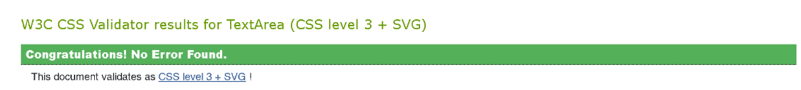
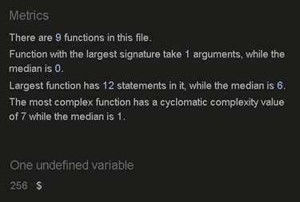
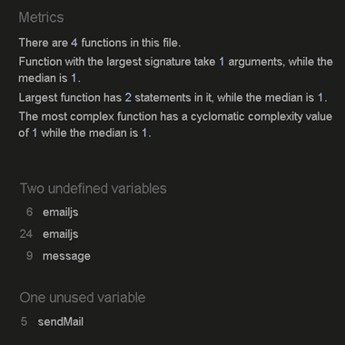
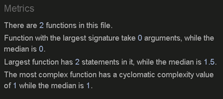

# LEARN TAROT - Testing

(Developer: Martyna Nowak)

[Live Webpage](https://mmnowak.github.io/tarot-quiz/index.html)

This is the testing documentation for the TarotQuiz website. For the full README file, [click here.](https://github.com/mmnowak/tarot-quiz/blob/main/README.md)

## Table of Contents

1. [Introduction](#introduction)
2. [Automated Testing](#automated-testing)
    1. [HTML Validation](#html-validation)
    2. [CSS Validation](#css-validation)
    3. [JavaScript Validation](#javascript-validation)
    3. [Accessibility](#accessibility-testing)
    4. [Performance](#performance)
3. [Manual Testing](#manual-testing)
    1. [Device testing](#performance-tests-on-various-devices)
    2. [Browser compatibility](#browser-compatibility)
    3. [Testing user stories](#testing-user-stories)
    4. [Feature testing results table](#feature-testing-results-table)
4. [Bugs and fixes](#bugs-and-fixes)

## Introduction

## Automated Testing

### HTML Validation

The W3C Markup Validation Service was used to validate the HTML of the website. No errors were found.

See Scores:

[Index Page](https://validator.w3.org/nu/?doc=https%3A%2F%2Fmmnowak.github.io%2Ftarot-quiz%2Findex.html)

[Game Page](https://validator.w3.org/nu/?doc=https%3A%2F%2Fmmnowak.github.io%2Ftarot-quiz%2Fgame.html)

[Learn Page](https://validator.w3.org/nu/?doc=https%3A%2F%2Fmmnowak.github.io%2Ftarot-quiz%2Flearn.html)

[Contact Page](https://validator.w3.org/nu/?doc=https%3A%2F%2Fmmnowak.github.io%2Ftarot-quiz%2Fcontact.html)

[404 Page](https://validator.w3.org/nu/?doc=https%3A%2F%2Fmmnowak.github.io%2Ftarot-quiz%2F404.html)

### CSS Validation

The W3C Jigsaw CSS Validation Service was used to validate the css file for the website via file upload. No errors were found.

### Javascript Validation

Quiz.js

Learn.js

Email.js

Error.js

### Accessibility Testing

The WAVE web accessibility evaluation tool by WebAIM was used to ensure the website is fully accessible. No errors were found.

See scores:

[Index.html](https://wave.webaim.org/report#/https://mmnowak.github.io/tarot-quiz/index.html)

[Game.html](https://wave.webaim.org/report#/https://mmnowak.github.io/tarot-quiz/game.html)

[Learn.html](https://wave.webaim.org/report#/https://mmnowak.github.io/tarot-quiz/learn.html)

[Contact.html](https://wave.webaim.org/report#/https://8000-mmnowak-myfulltemplate-lmfoz60052m.ws-eu104.gitpod.io/contact.html)

[404.html](https://wave.webaim.org/report#/https://8000-mmnowak-myfulltemplate-lmfoz60052m.ws-eu104.gitpod.io/404.html)

### Performance

## Manual Testing

### Device testing
### Browser compatibility
### Testing user stories
### Feature testing results table

## Bugs and fixes