# LEARN TAROT - Testing

(Developer: Martyna Nowak)

[Live Webpage](https://mmnowak.github.io/tarot-quiz/index.html)

This is the testing documentation for the TarotQuiz website. For the full README file, [click here.](https://github.com/mmnowak/tarot-quiz/blob/main/README.md)

## Table of Contents

1. [Introduction](#introduction)
2. [Automated Testing](#automated-testing)
    1. [HTML Validation](#html-validation)
    2. [CSS Validation](#css-validation)
    3. [JavaScript Validation](#javascript-validation)
    3. [Accessibility](#accessibility-testing)
    4. [Performance](#performance)
3. [Manual Testing](#manual-testing)
    1. [Device testing](#performance-tests-on-various-devices)
    2. [Browser compatibility](#browser-compatibility)
    3. [Testing user stories](#testing-user-stories)
    4. [Feature testing results table](#feature-testing-results-table)
4. [Bugs and fixes](#bugs-and-fixes)

## Introduction

## Automated Testing

### HTML Validation

The W3C Markup Validation Service was used to validate the HTML of the website. No errors were found.

See Scores:

[Index Page](https://validator.w3.org/nu/?doc=https%3A%2F%2Fmmnowak.github.io%2Ftarot-quiz%2Findex.html)

[Game Page](https://validator.w3.org/nu/?doc=https%3A%2F%2Fmmnowak.github.io%2Ftarot-quiz%2Fgame.html)

[Learn Page](https://validator.w3.org/nu/?doc=https%3A%2F%2Fmmnowak.github.io%2Ftarot-quiz%2Flearn.html)

[Contact Page](https://validator.w3.org/nu/?doc=https%3A%2F%2Fmmnowak.github.io%2Ftarot-quiz%2Fcontact.html)

[404 Page](https://validator.w3.org/nu/?doc=https%3A%2F%2Fmmnowak.github.io%2Ftarot-quiz%2F404.html)

### CSS Validation

The W3C Jigsaw CSS Validation Service was used to validate the css file for the website via file upload. No errors were found.

### Javascript Validation

JSHint was used to validate the HTML of the website. No errors were found. There were some warnings, all related to either EmailJS API or a bootstrap modal.

Quiz.js

The undefined variable `"$"` comes from a command taken from the Bootstrap documentation `("$(endModal).modal('show')")` which depends on jquery. My attempts to rewrite it into vanilla JS were unsuccessful.

Learn.js

Email.js

The undefined variables come from EmailJS API. The unused variable is actually a function being called when the user presses the SEND button.

Error.js

### Accessibility Testing

The WAVE web accessibility evaluation tool by WebAIM was used to ensure the website is fully accessible. No errors were found.

See scores:

[Index.html](https://wave.webaim.org/report#/https://mmnowak.github.io/tarot-quiz/index.html)

[Game.html](https://wave.webaim.org/report#/https://mmnowak.github.io/tarot-quiz/game.html)

[Learn.html](https://wave.webaim.org/report#/https://mmnowak.github.io/tarot-quiz/learn.html)

[Contact.html](https://wave.webaim.org/report#/https://mmnowak.github.io/tarot-quiz/contact.html)

[404.html](https://wave.webaim.org/report#/https://mmnowak.github.io/tarot-quiz/404.html)

All the alerts refer to either a redundant link in the navigation bar (both HOME link and the site name lead to the index page when clicked on) or missing h1 heading on the game page.

### Performance

Google Lighthouse in Google Chrome Developer Tools was used to test the performance of the website. All pages have passed the audit.

Index page

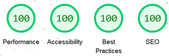

Game page

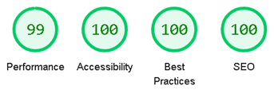

Learn page

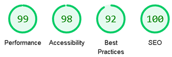

Contact page

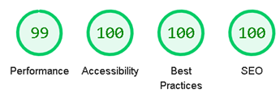

404 page

## Manual Testing

### Device testing
### Browser compatibility

| **Browser** | **Feature** | **Works as expected** | 
|:-----------:|:-----------:|:---------------------:|
| Google Chrome | Navigation bar links | Yes |
| Google Chrome | Index Page | Yes |
| Google Chrome | Index Page Buttons | Yes |
| Google Chrome | How to play button | Yes |
| Google Chrome | How to play modal | Yes |
| Google Chrome | Progress bar | Yes |
| Google Chrome | Score counter | Yes |
| Google Chrome | Timer | Yes |
| Google Chrome | Quiz section | Yes |
| Google Chrome | End game modal | Yes |
| Google Chrome | Flashcards | Yes |
| Google Chrome | Full meaning button | Yes |
| Google Chrome | Next card button | Yes |
| Google Chrome | Contact form | Yes |
| Google Chrome | 404 page | Yes |
| Opera | Navigation bar links | Yes |
| Opera | Index Page | Yes |
| Opera | Index Page Buttons | Yes |
| Opera | How to play button | Yes |
| Opera | How to play modal | Yes |
| Opera | Progress bar | Yes |
| Opera | Score counter | Yes |
| Opera | Timer | Yes |
| Opera | Quiz section | Yes |
| Opera | End game modal | Yes |
| Opera | Flashcards | Yes |
| Opera | Full meaning button | Yes |
| Opera | Next card button | Yes |
| Opera | Contact form | Yes |
| Opera | 404 page | Yes |
| Microsoft Edge | Navigation bar links | Yes |
| Microsoft Edge | Index Page | Yes |
| Microsoft Edge | Index Page Buttons | Yes |
| Microsoft Edge | How to play button | Yes |
| Microsoft Edge | How to play modal | Yes |
| Microsoft Edge | Progress bar | Yes |
| Microsoft Edge | Score counter | Yes |
| Microsoft Edge | Timer | Yes |
| Microsoft Edge | Quiz section | Yes |
| Microsoft Edge | End game modal | Yes |
| Microsoft Edge | Flashcards | Yes |
| Microsoft Edge | Full meaning button | Yes |
| Microsoft Edge | Next card button | Yes |
| Microsoft Edge | Contact form | Yes |
| Microsoft Edge | 404 page | Yes |
| Ecosia | Navigation bar links | Yes |
| Ecosia | Index Page | Yes |
| Ecosia | Index Page Buttons | Yes |
| Ecosia | How to play button | Yes |
| Ecosia | How to play modal | Yes |
| Ecosia | Progress bar | Yes |
| Ecosia | Score counter | Yes |
| Ecosia | Timer | Yes |
| Ecosia | Quiz section | Yes |
| Ecosia | End game modal | Yes |
| Ecosia | Flashcards | Yes |
| Ecosia | Full meaning button | Yes |
| Ecosia | Next card button | Yes |
| Ecosia | Contact form | Yes |
| Ecosia | 404 page | Yes |

### Testing user stories

#### First Time visitor
1.	As a first-time user, I want to know the purpose of the site immediately.

| **Feature** | **Action** | **Expected Result** | **Actual Result** |
|:-----------:|:----------:|:-------------------:|:-----------------:|
| Index Page | Navigate to the index page | The index paragraph displays | Works as expected |

See more

---
2.	As a first-time user, I want to easily find out how to play the game.

| **Feature** | **Action** | **Expected Result** | **Actual Result** |
|:-----------:|:----------:|:-------------------:|:-----------------:|
| How to play button | Navigate to the index and click the button | See instructions | Works as expected |

See more

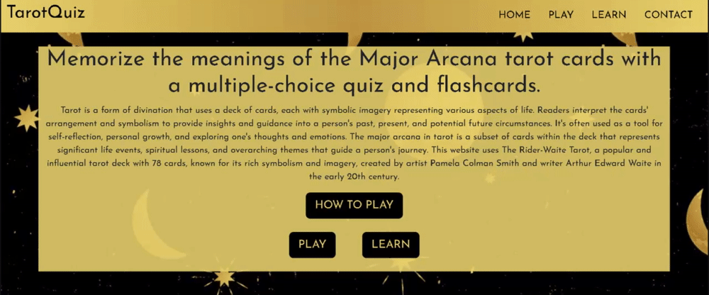

---
3.	As a first-time user, I want to know how far along I am in the quiz game.

| **Feature** | **Action** | **Expected Result** | **Actual Result** |
|:-----------:|:----------:|:-------------------:|:-----------------:|
| Progress bar | Select an answer to progresss to the next question | Progress bar updates | Works as expected |

See more

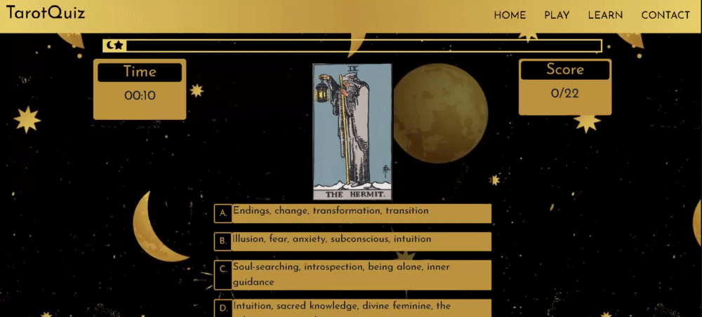

---
4.	As a first-time user, I want to know whether the answer I selected was right or wrong.

| **Feature** | **Action** | **Expected Result** | **Actual Result** |
|:-----------:|:----------:|:-------------------:|:-----------------:|
| Game section | Select an answer | Selected answer is highlighted green for correct and red for incorrect | Works as expected |

See more

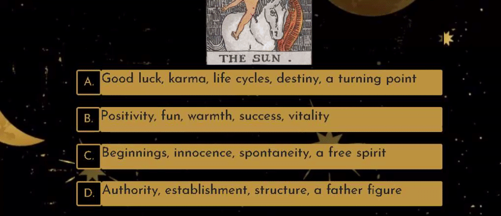

---
5.	As a first-time user, I want to know my score.

| **Feature** | **Action** | **Expected Result** | **Actual Result** |
|:-----------:|:----------:|:-------------------:|:-----------------:|
| Score count | Select the correct answer to increase the score | Score count increases by 1 for each correct answer | Works as expected |

See more

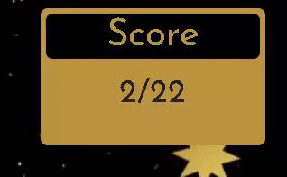

---
6.	As a first-time user, I want to receive feedback about my performance.

| **Feature** | **Action** | **Expected Result** | **Actual Result** |
|:-----------:|:----------:|:-------------------:|:-----------------:|
| Modal | Finish the game | The end game modal pops up with a final message | Works as expected |

See more

---
7.	As a first-time user, I want to find out how to use the flashcards page.

| **Feature** | **Action** | **Expected Result** | **Actual Result** |
|:-----------:|:----------:|:-------------------:|:-----------------:|
| Learn page | Navigate to the Learn page | See instructions | Works as expected |

See more

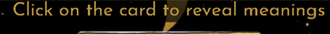

#### Returning visitor
8.	As a returning user, I want the feedback at the end of the game to reflect my performance.

| **Feature** | **Action** | **Expected Result** | **Actual Result** |
|:-----------:|:----------:|:-------------------:|:-----------------:|
| Modal | Answer all the question | The end game modal displays the final score, time and a message relevant to user performance | Works as expected |

See more

---
9.	As a returning user, I want to be able to contact the page owners with any feedback I might have.

| **Feature** | **Action** | **Expected Result** | **Actual Result** |
|:-----------:|:----------:|:-------------------:|:-----------------:|
| Contact Page | Navigate to the contact page | Fill the form and click send | Works as expected |

See more

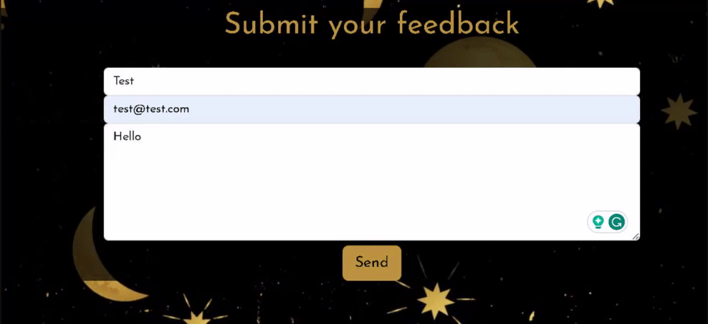

---
10.	As a returning user, I want to find out the full meaning of each card.

| **Feature** | **Action** | **Expected Result** | **Actual Result** |
|:-----------:|:----------:|:-------------------:|:-----------------:|
| See full meaning button | Click on the button | A modal displaying each card's full meaning pops up | Works as expected |

See more

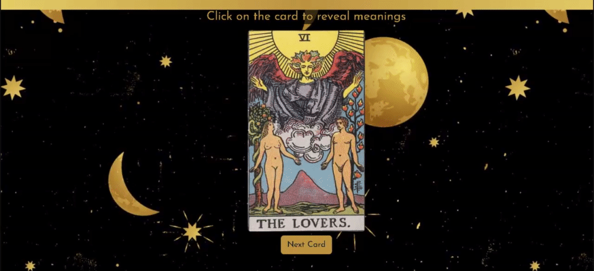

---
11.	As a returning user, I want to be able to navigate the website easily.

| **Feature** | **Action** | **Expected Result** | **Actual Result** |
|:-----------:|:----------:|:-------------------:|:-----------------:|
| Navigation bar | Click on any link | Go to a corresponding page | Works as expected |
| Index buttons | Click on the buttons | Go to a corresponding page | Works as expected |
| End game modal buttons | Click on the button | Go to a corresponding page | Works as expected |
| Navigation bar | Click on the website name | Go to the index page | Works as expected |

See more

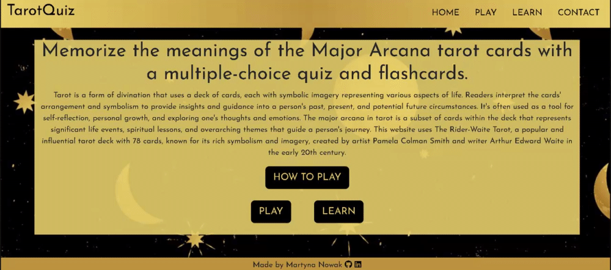
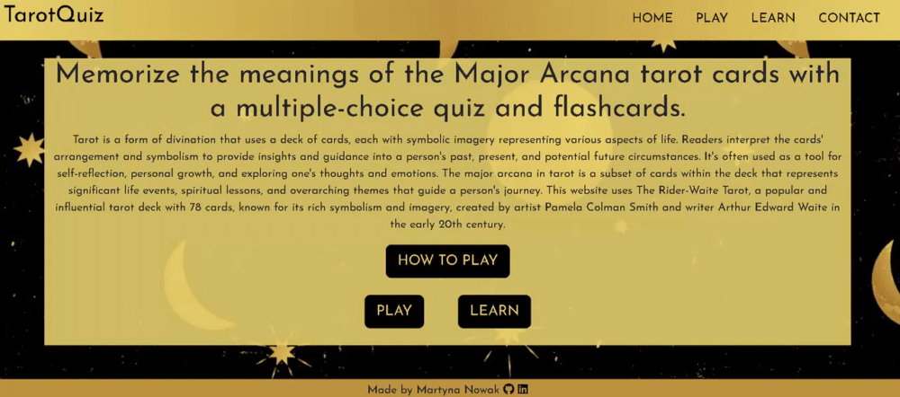
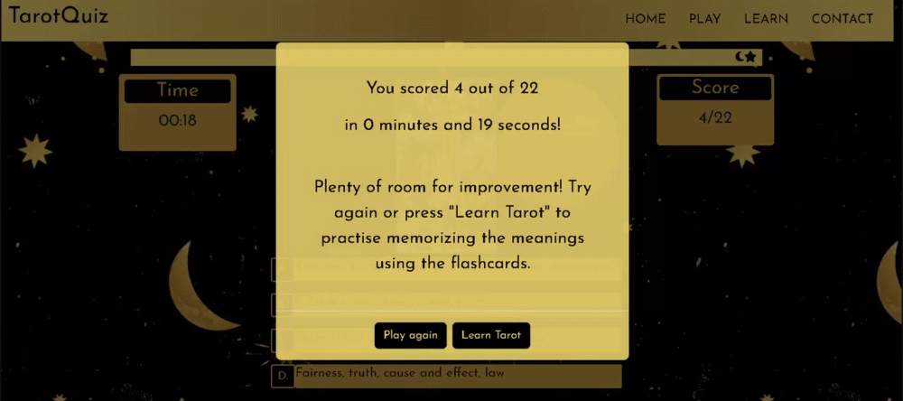
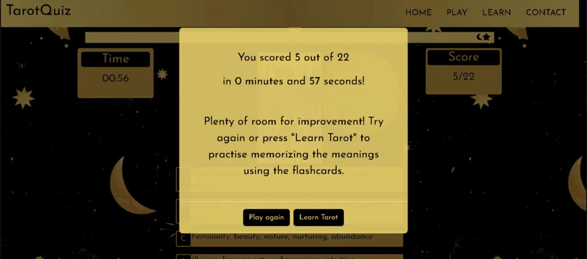
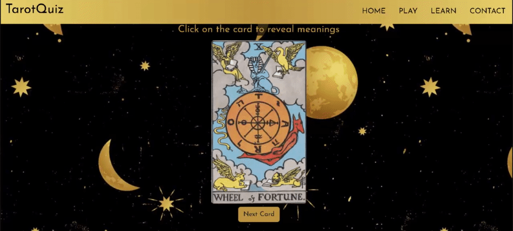

---
12. As the returning user, I want to be able to view the site on a range of device sizes.

| **Feature** | **Action** | **Expected Result** | **Actual Result** |
|:-----------:|:----------:|:-------------------:|:-----------------:|
| Web page | Open the website on your device | The website displays correctly | Works as expected |

[See more](#device-testing)

---
13. As a returning user, I want to be able to easily find my way back if I encounter an error page.

| **Feature** | **Action** | **Expected Result** | **Actual Result** |
|:-----------:|:----------:|:-------------------:|:-----------------:|
| 404 Page | Click on the go back home button | Go to the index page | Works as expected |
| 404 Page | Wait 10 seconds to be automatically redirected | Go to the index page | Works as expected |

See more

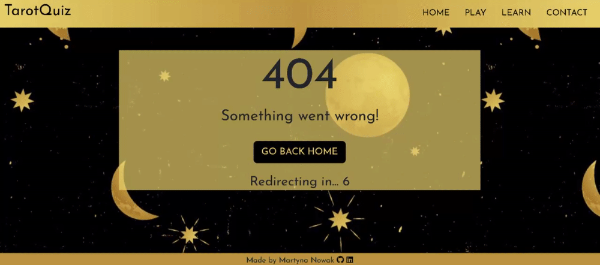
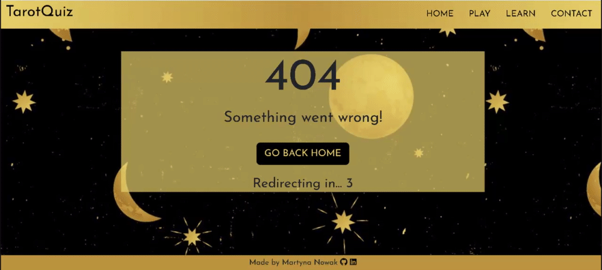

### Feature testing results table

## Bugs and fixes