# LEARN TAROT - Testing

(Developer: Martyna Nowak)

[Live Webpage](https://mmnowak.github.io/tarot-quiz/index.html)

This is the testing documentation for the TarotQuiz website. For the full README file, [click here.](https://github.com/mmnowak/tarot-quiz/blob/main/README.md)

## Table of Contents

1. [Introduction](#introduction)
2. [Automated Testing](#automated-testing)
    1. [HTML Validation](#html-validation)
    2. [CSS Validation](#css-validation)
    3. [JavaScript Validation](#javascript-validation)
    3. [Accessibility](#accessibility-testing)
    4. [Performance](#performance)
3. [Manual Testing](#manual-testing)
    1. [Device testing](#performance-tests-on-various-devices)
    2. [Browser compatibility](#browser-compatibility)
    3. [Testing user stories](#testing-user-stories)
    4. [Feature testing results table](#feature-testing-results-table)
4. [Bugs and fixes](#bugs-and-fixes)

## Introduction

I undertook manual testing throughout the website development. The testing involved manually checking if all the buttons, links and JavaScript functions were working as intended. The website was manually tested on different devices, as well as the Google Developer Tools simulator. The details of the final manual tests implemented are detailed in this document.

Additionally, automated testing was performed, which included validating the HTML, CSS and JavaScript code, as well as checking the website's accessibility and performance. While all the tests were performed for both the development and deployed versions of the website throughout the process, the results outlined below are based on the [deployed page](https://mmnowak.github.io/tarot-quiz/index.html).

## Automated Testing

### HTML Validation

The W3C Markup Validation Service was used to validate the HTML of the website. No errors were found.

See Scores:

[Index Page](https://validator.w3.org/nu/?doc=https%3A%2F%2Fmmnowak.github.io%2Ftarot-quiz%2Findex.html)

[Game Page](https://validator.w3.org/nu/?doc=https%3A%2F%2Fmmnowak.github.io%2Ftarot-quiz%2Fgame.html)

[Learn Page](https://validator.w3.org/nu/?doc=https%3A%2F%2Fmmnowak.github.io%2Ftarot-quiz%2Flearn.html)

[Contact Page](https://validator.w3.org/nu/?doc=https%3A%2F%2Fmmnowak.github.io%2Ftarot-quiz%2Fcontact.html)

[404 Page](https://validator.w3.org/nu/?doc=https%3A%2F%2Fmmnowak.github.io%2Ftarot-quiz%2F404.html)

### CSS Validation

The W3C Jigsaw CSS Validation Service was used to validate the css file for the website via file upload. No errors were found.

### Javascript Validation

JSHint was used to validate the HTML of the website. No errors were found. There were some warnings, all related to either EmailJS API or a bootstrap modal.

Quiz.js

The undefined variable `"$"` comes from a command taken from the Bootstrap documentation `("$(endModal).modal('show')")` which depends on jquery. My attempts to rewrite it into vanilla JS were unsuccessful.

Learn.js

Email.js

The undefined variables come from EmailJS API. The unused variable is actually a function being called when the user presses the SEND button.

Error.js

### Accessibility Testing

The WAVE web accessibility evaluation tool by WebAIM was used to ensure the website is fully accessible. No errors were found.

See scores:

[Index.html](https://wave.webaim.org/report#/https://mmnowak.github.io/tarot-quiz/index.html)

[Game.html](https://wave.webaim.org/report#/https://mmnowak.github.io/tarot-quiz/game.html)

[Learn.html](https://wave.webaim.org/report#/https://mmnowak.github.io/tarot-quiz/learn.html)

[Contact.html](https://wave.webaim.org/report#/https://mmnowak.github.io/tarot-quiz/contact.html)

[404.html](https://wave.webaim.org/report#/https://mmnowak.github.io/tarot-quiz/404.html)

All the alerts refer to either a redundant link in the navigation bar (both the HOME link and the site name lead to the index page when clicked on) or a missing h1 heading on the game page.

### Performance

Google Lighthouse in Google Chrome Developer Tools was used to test the performance of the website. All pages have passed the audit.

Index page

Game page

Learn page

Contact page

404 page

## Manual Testing

### Device testing

The website was tested on the following devices:

* Lenovo Yoga 460
* Xiaomi 11 Lite
* iPad 5gen ver iPadOS 16.6
* iPhone 14 Pro
* iPhone 13
* Google Pixel 4a
* iPhone XR
* Google Chrome Developer Tools -  all the different device avaliable, as well as all the size options

There were no issues found.

Here are screenshots of the site as viewed on selected devices:

Xiaomi 11 Lite

Index Page:

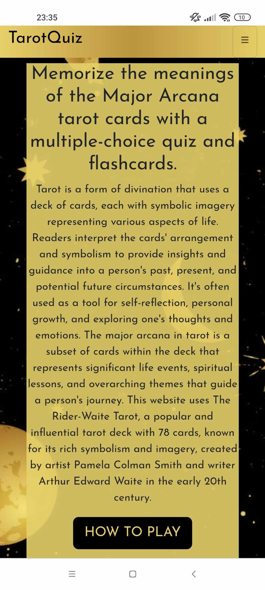

Game Page:

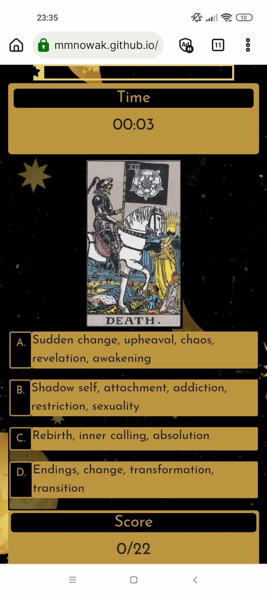

Learn Page:

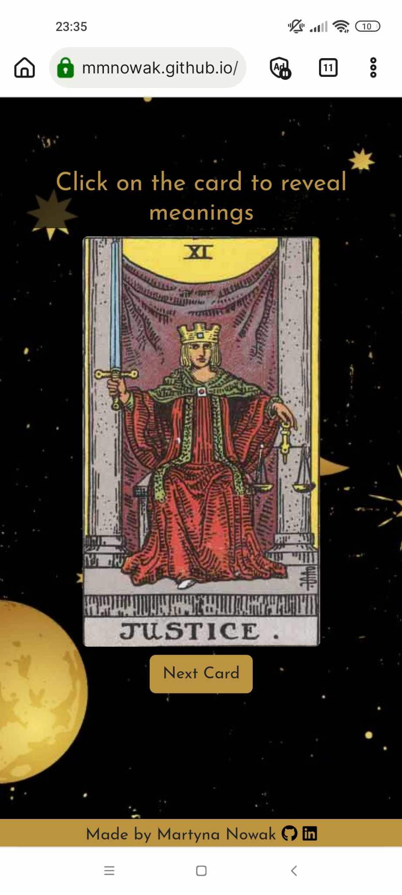

Contact Page:

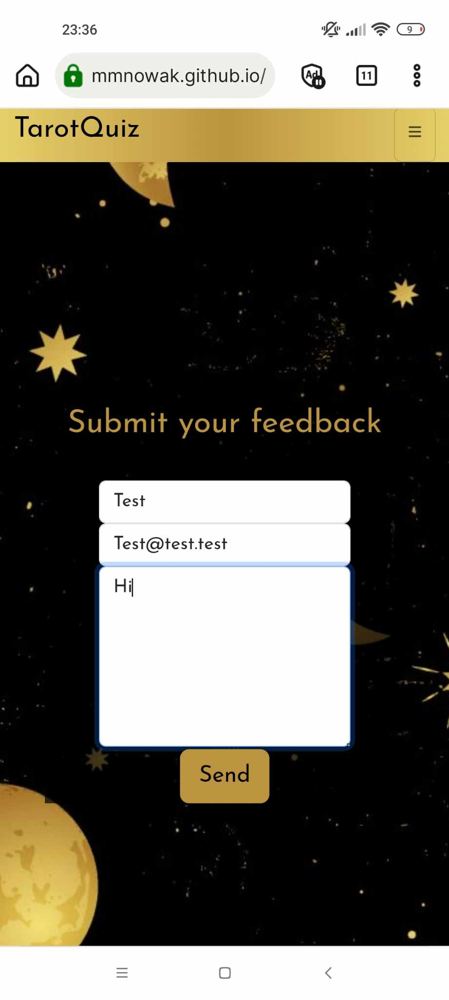

404 Page:

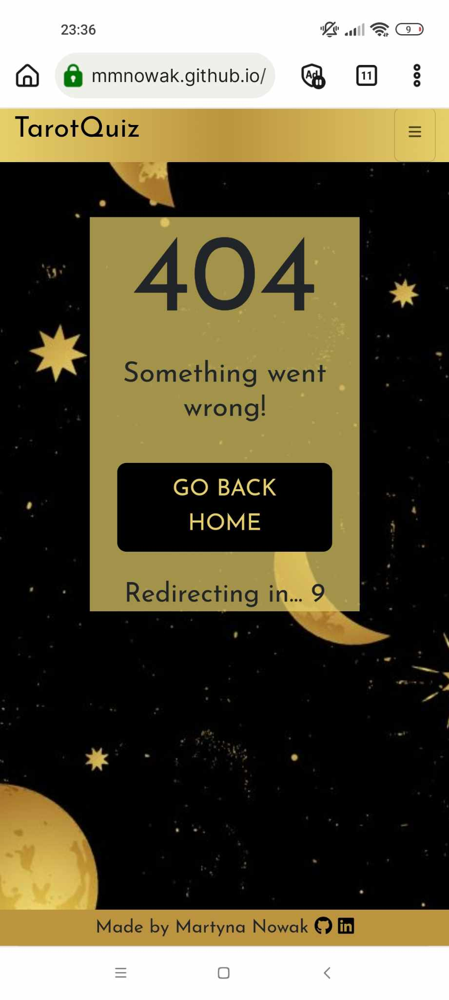

Lenovo Yoga 460

Index Page:

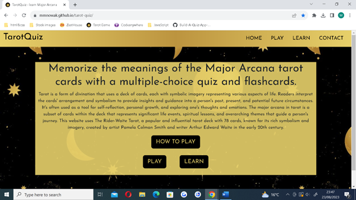

Game Page:

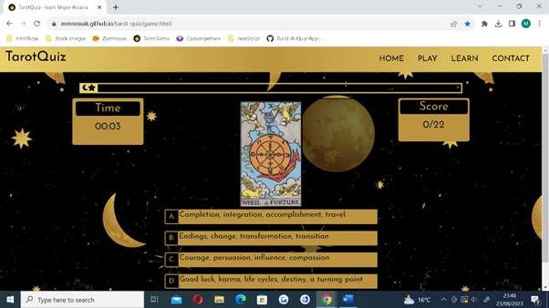

Learn Page:

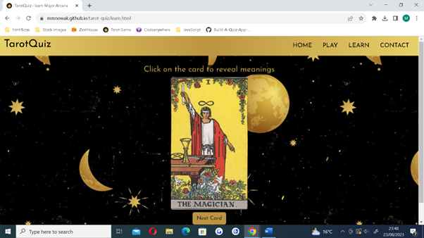

Contact Page:

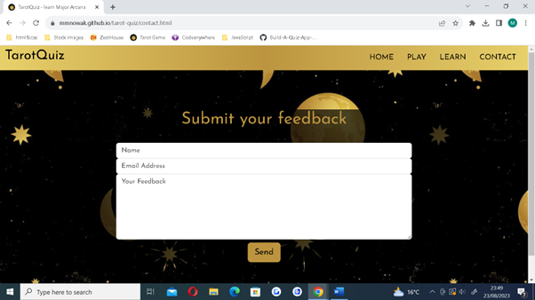

404 Page:

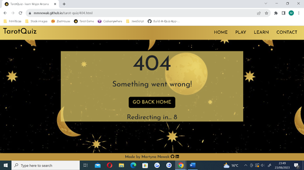

### Browser compatibility

| **Browser** | **Feature** | **Works as expected** | 
|:-----------:|:-----------:|:---------------------:|
| Google Chrome | Navigation bar links | Yes |
| Google Chrome | Index Page | Yes |
| Google Chrome | Index Page Buttons | Yes |
| Google Chrome | How to play button | Yes |
| Google Chrome | How to play modal | Yes |
| Google Chrome | Progress bar | Yes |
| Google Chrome | Score counter | Yes |
| Google Chrome | Timer | Yes |
| Google Chrome | Quiz section | Yes |
| Google Chrome | End game modal | Yes |
| Google Chrome | Flashcards | Yes |
| Google Chrome | Full meaning button | Yes |
| Google Chrome | Next card button | Yes |
| Google Chrome | Contact form | Yes |
| Google Chrome | 404 page | Yes |
| Opera | Navigation bar links | Yes |
| Opera | Index Page | Yes |
| Opera | Index Page Buttons | Yes |
| Opera | How to play button | Yes |
| Opera | How to play modal | Yes |
| Opera | Progress bar | Yes |
| Opera | Score counter | Yes |
| Opera | Timer | Yes |
| Opera | Quiz section | Yes |
| Opera | End game modal | Yes |
| Opera | Flashcards | Yes |
| Opera | Full meaning button | Yes |
| Opera | Next card button | Yes |
| Opera | Contact form | Yes |
| Opera | 404 page | Yes |
| Microsoft Edge | Navigation bar links | Yes |
| Microsoft Edge | Index Page | Yes |
| Microsoft Edge | Index Page Buttons | Yes |
| Microsoft Edge | How to play button | Yes |
| Microsoft Edge | How to play modal | Yes |
| Microsoft Edge | Progress bar | Yes |
| Microsoft Edge | Score counter | Yes |
| Microsoft Edge | Timer | Yes |
| Microsoft Edge | Quiz section | Yes |
| Microsoft Edge | End game modal | Yes |
| Microsoft Edge | Flashcards | Yes |
| Microsoft Edge | Full meaning button | Yes |
| Microsoft Edge | Next card button | Yes |
| Microsoft Edge | Contact form | Yes |
| Microsoft Edge | 404 page | Yes |
| Ecosia | Navigation bar links | Yes |
| Ecosia | Index Page | Yes |
| Ecosia | Index Page Buttons | Yes |
| Ecosia | How to play button | Yes |
| Ecosia | How to play modal | Yes |
| Ecosia | Progress bar | Yes |
| Ecosia | Score counter | Yes |
| Ecosia | Timer | Yes |
| Ecosia | Quiz section | Yes |
| Ecosia | End game modal | Yes |
| Ecosia | Flashcards | Yes |
| Ecosia | Full meaning button | Yes |
| Ecosia | Next card button | Yes |
| Ecosia | Contact form | Yes |
| Ecosia | 404 page | Yes |

### Testing user stories

#### First Time visitor
1.	As a first-time user, I want to know the purpose of the site immediately.

| **Feature** | **Action** | **Expected Result** | **Actual Result** |
|:-----------:|:----------:|:-------------------:|:-----------------:|
| Index Page | Navigate to the index page | The index paragraph displays | Works as expected |

See more

---
2.	As a first-time user, I want to easily find out how to play the game.

| **Feature** | **Action** | **Expected Result** | **Actual Result** |
|:-----------:|:----------:|:-------------------:|:-----------------:|
| How to play button | Navigate to the index and click the button | See instructions | Works as expected |

See more

---
3.	As a first-time user, I want to know how far along I am in the quiz game.

| **Feature** | **Action** | **Expected Result** | **Actual Result** |
|:-----------:|:----------:|:-------------------:|:-----------------:|
| Progress bar | Select an answer to progresss to the next question | Progress bar updates | Works as expected |

See more

---
4.	As a first-time user, I want to know whether the answer I selected was right or wrong.

| **Feature** | **Action** | **Expected Result** | **Actual Result** |
|:-----------:|:----------:|:-------------------:|:-----------------:|
| Game section | Select an answer | Selected answer is highlighted green for correct and red for incorrect | Works as expected |

See more

---
5.	As a first-time user, I want to know my score.

| **Feature** | **Action** | **Expected Result** | **Actual Result** |
|:-----------:|:----------:|:-------------------:|:-----------------:|
| Score count | Select the correct answer to increase the score | Score count increases by 1 for each correct answer | Works as expected |

See more

---
6.	As a first-time user, I want to receive feedback about my performance.

| **Feature** | **Action** | **Expected Result** | **Actual Result** |
|:-----------:|:----------:|:-------------------:|:-----------------:|
| Modal | Finish the game | The end game modal pops up with a final message | Works as expected |

See more

---
7.	As a first-time user, I want to find out how to use the flashcards page.

| **Feature** | **Action** | **Expected Result** | **Actual Result** |
|:-----------:|:----------:|:-------------------:|:-----------------:|
| Learn page | Navigate to the Learn page | See instructions | Works as expected |

See more

#### Returning visitor
8.	As a returning user, I want the feedback at the end of the game to reflect my performance.

| **Feature** | **Action** | **Expected Result** | **Actual Result** |
|:-----------:|:----------:|:-------------------:|:-----------------:|
| Modal | Answer all the questions | The end game modal displays the final score, time and a message relevant to user performance | Works as expected |

See more

---
9.	As a returning user, I want to be able to contact the page owners with any feedback I might have.

| **Feature** | **Action** | **Expected Result** | **Actual Result** |
|:-----------:|:----------:|:-------------------:|:-----------------:|
| Contact Page | Navigate to the contact page | Fill the form and click send | Works as expected |

See more

---
10.	As a returning user, I want to find out the full meaning of each card.

| **Feature** | **Action** | **Expected Result** | **Actual Result** |
|:-----------:|:----------:|:-------------------:|:-----------------:|
| See full meaning button | Click on the button | A modal displaying each card's full meaning pops up | Works as expected |

See more

---
11.	As a returning user, I want to be able to navigate the website easily.

| **Feature** | **Action** | **Expected Result** | **Actual Result** |
|:-----------:|:----------:|:-------------------:|:-----------------:|
| Navigation bar | Click on any link | Go to a corresponding page | Works as expected |
| Index buttons | Click on the buttons | Go to a corresponding page | Works as expected |
| End game modal buttons | Click on the button | Go to a corresponding page | Works as expected |
| Navigation bar | Click on the website name | Go to the index page | Works as expected |

See more

---
12. As a returning user, I want to be able to view the site on a range of device sizes.

| **Feature** | **Action** | **Expected Result** | **Actual Result** |
|:-----------:|:----------:|:-------------------:|:-----------------:|
| Web page | Open the website on your device | The website displays correctly | Works as expected |

[See more](#device-testing)

---
13. As a returning user, I want to be able to easily find my way back if I encounter an error page.

| **Feature** | **Action** | **Expected Result** | **Actual Result** |
|:-----------:|:----------:|:-------------------:|:-----------------:|
| 404 Page | Click on the go back home button | Go to the index page | Works as expected |
| 404 Page | Wait 10 seconds to be automatically redirected | Go to the index page | Works as expected |

See more

### Feature testing results table

**All Pages**

| Feature | Expected Outcome | Testing Performed | Result | Pass/Fail |
| --- | --- | --- | --- | --- |
| Whole Page | The page is fully responsive | Tested on various devices as well as Google Developer Tools screen size simulator | All elements are fully responsive | Pass |
| Background Image | Appears on all pages, the blur effect is displayed | Tested on various device sizes and browsers | Appears correctly | Pass |
| Favicon | Appears on all pages| Tested on various device sizes and browsers | Appears correctly | Pass |
| Navigation bar | Appears on all pages, collapses into a hamburger menu on smaller devices | Tested on various device sizes and browsers | Appears correctly | Pass |
| Navigation bar links | Opens correct pages when clicked | Clicked on the links | Links open correctly | Pass |
| Navigation bar logo | Opens the index page when clicked | Clicked on the logo | Directs to the index page | Pass |
| Footer | Appears on all pages, is at the bottom of the page | Tested on various device sizes and browsers | Appears correctly | Pass |
| Footer Social Links | Correct links open in a new tab when clicked | Click on the icons | Work correctly | Pass |
| Footer Social Links | Increase in size on hover | Hover on icons | Work correctly | Pass |
| Console | No errors appear | Tested all the pages via Google Dev Tools | No errors are logged other than the Permission Policy Error, [read more here](#unresolved-bugs) | Pass |

**Index Page**

| Feature | Expected Outcome | Testing Performed | Result | Pass/Fail |
| --- | --- | --- | --- | --- |
| Index Page | Text appears as expected | Loading the index page | Text appears as expected | Pass |
| Index Page Buttons | Button text changes colour on hover | Hover on the index buttons | Text colour changes | Pass |
| How to Play button | A modal pops up | Click on the button | The modal appears as expected | Pass |
| Play Button | Directs to the game.html page | Click on the button | The Game page opens | Pass |
| Learn Button | Directs to the learn.html page | Click on the button | The Learn page opens | Pass |

**Quiz Page**

| Feature | Expected Outcome | Testing Performed | Result | Pass/Fail |
| --- | --- | --- | --- | --- |
| Question Picture | Displays a random Tarot card | Load the page; progress onto the next question; go through each card | All cards displaying correctly | Pass |
| Answer options | Displays four possible answers | Load the page; progress onto the next question; go through each card | The answers displaying correctly for each card | Pass |
| Correct answers | Answer container turns green if correct | Click on the correct answer | The answer turns green  | Pass |
| Incorrect answers | Answer container turns red if incorrect | Click on the correct answer | The answer turns red  | Pass |
| Game | A new question is loaded after the answer is selected | Select answer | Progress onto the next question | Pass |
| Score count | The score count increases by 1 every time a correct answer is selected | Click on the correct answer | The score increases by 1  | Pass |
| Timer | The timer starts as the game is loaded | Load the game.html page | The timer starts 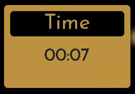 | Pass |
| Timer | The timer pauses as the game is finished | Play until the end | The timer stops | Pass |
| Progress bar | The bar increases after each question is loaded | Play the game | The progress bar increases  | Pass |
| End Game Modal | The modal pops up once all the questions are answered | Play until the end | The modal pops up  | Pass |
| End Game Modal | The modal displays the correct final score and time | Play until the end | The modal displays correct stats | Pass |
| End Game Modal | The modal message changes depending on user score | Play until the end | The message changes depending on the final score (see [README](README.md) file) | Pass |
| Play Again Button | The game restarts once the button is clicked | Click the button | The game restarts  | Pass |
| Learn Tarot Button | Directs to the Learn.html page | Click the button | The Learn.html page is loaded  | Pass |

**Learn Page**

| Feature | Expected Outcome | Testing Performed | Result | Pass/Fail |
| --- | --- | --- | --- | --- |
| Show card function | A random card is loaded | Load the page | A card appears | Pass |
| Next card button | A random card is loaded | Click the button | A card appears  | Pass |
| Flip card function | The card flips when clicked; the meaning keywords are displayed | Click on a card | The meaning keywords are revealed  | Pass |
| Full Meaning button | A modal containing each card full meaning appears | Click on the button; test every card | The correct full meaning displays correctly for each card  | Pass |
| Instructions paragraph | A short instruction paragraph is displayed | Load the page | The paragraph appears correctly | Pass |

**Contact Page**

| Feature | Expected Outcome | Testing Performed | Result | Pass/Fail |
| --- | --- | --- | --- | --- |
| Contact Form | The form is displayed correctly | Load the page | The form appears | Pass |
| Required fields | Submitting a form with empty fields is disabled | Try to submit the form with empty fields | A "Please fill out this field" message appears | Pass |
| Email required | Submitting a form with an invalid email address is disabled | Try to submit the form with the email address missing the '@' symbol | A "Please include an '@' in the email address" message appears | Pass |
| Submit form | Sends the email correctly | Click the Send button; see a SUCCESS message being logged onto the console | Email sends correctly | Pass |
| Thank you message | A Thank You modal appears when the form is submitted | Submit the form | A Thank You message appears 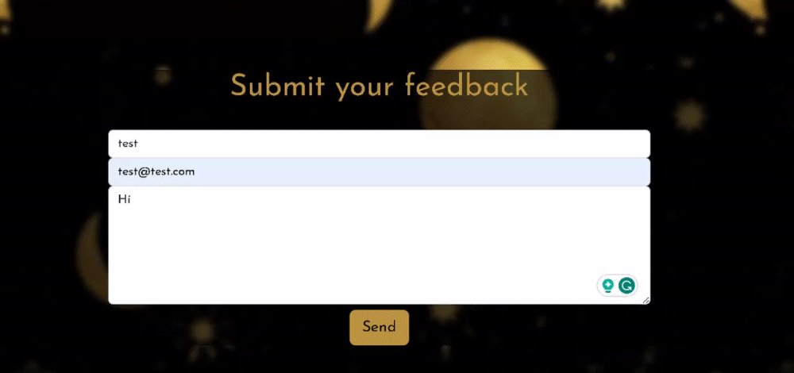 | Pass |

**404 Page**

| Feature | Expected Outcome | Testing Performed | Result | Pass/Fail |
| --- | --- | --- | --- | --- |
| 404 Page | Custom 404 Page appears when a page cannot be found | Enter a wrong page address | The 404 Page appears | Pass |
| 404 Text | The paragraph text is displayed properly | Load the 404 Page | The text appears correctly | Pass |
| Go Back Home button | The button directs back to the Index page | Click the button | The Index page is loaded  | Pass |
| Go Back Home button | The button text changes colour on hover | Hover on button | The colour changes | Pass |
| Automatic redirection | The index page opens automatically after 10 seconds | Wait 10 seconds | The Index page is loaded   | Pass |
| Countdown | A countdown is displayed correctly | Load the 404 page | The countdown appears and works correctly | Pass |

## Bugs and fixes

### Solved bugs

**Footer not staying at the bottom**

The footer would not stay at the bottom regardless of the `bottom: 0` and `margin-bottom: 0` properties; adding a `sticky-bottom` or `fixed-bottom` caused it to obscure the main content, especially when viewed on a small screen. This was solved by enclosing both the page and the footed in a `id="page-container"` div with a property `position: relative`, giving the footer a property `position: absolute` and then enclosing the page content into a `#content-container` div with a `padding-bottom` property set to the same height as the footer. 

**End game modal bug**

During testing, I encountered a major bug. The end game modal containing the user's final score, time and a message was showing up as question #22 was loaded, rather than after it was answered.

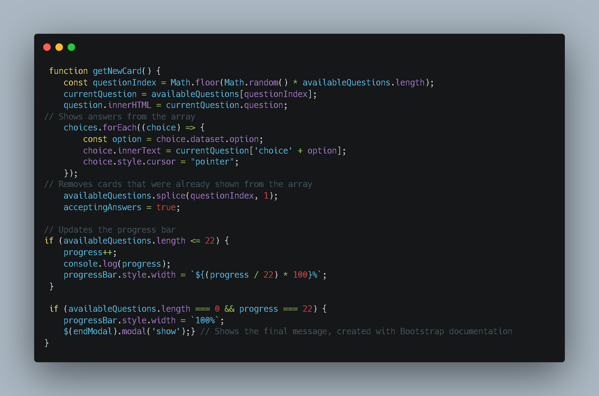

This was fixed by rearranging the getNewCard() function. I moved the if statement checking for the progress to the beginning of the function. Now the function checks if the progress equals or is bigger than 22 first and displays the modal if this condition is met. The rest of the function is enclosed in the 'else' part of the if statement.

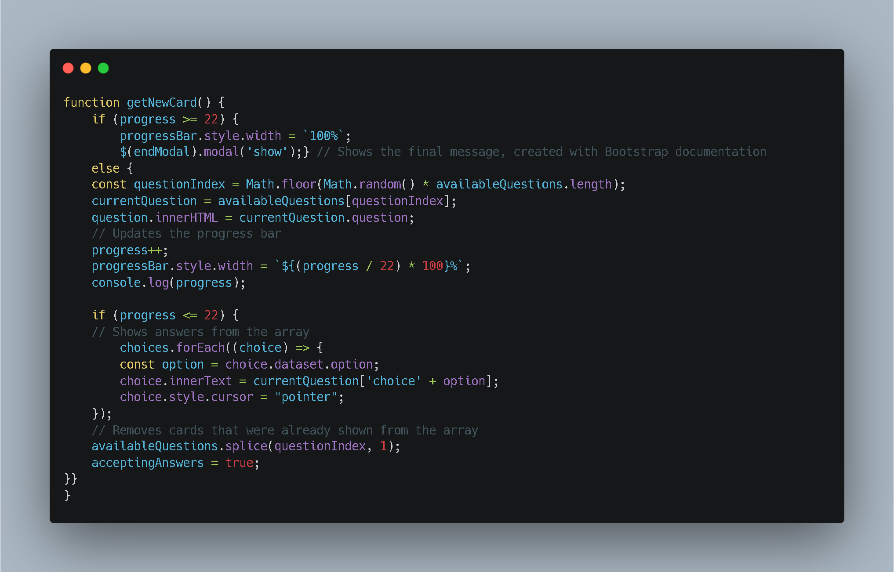

### Unresolved bugs

**Permission-policy error**

The following bug shows up on the console: "Error with Permissions-Policy header: Origin trial controlled feature not enabled: 'interest-cohort'".

After googling it, I tried to resolve this by inserting `<meta http-equiv="Permissions-Policy" content="interest-cohort=(), user-id=()">` into the head element. Unfortunately, this did not work and caused an error to be displayed when validating HTML via the W3C Markup Validation Service.

This error is specific to pages hosted by services such as Github Pages and relates to Google's FLoC (alternative to cookies) technology. Although unresolved, it does not impact the website's functionality.